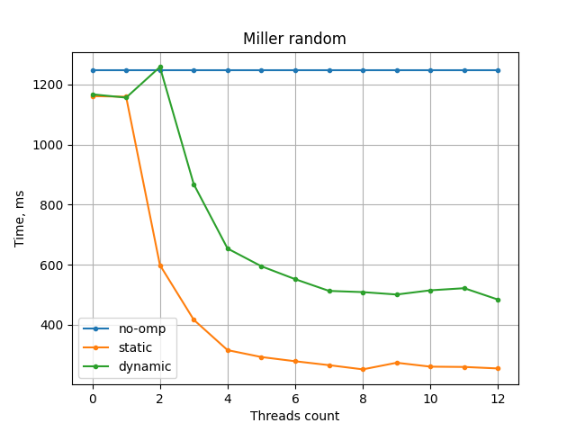
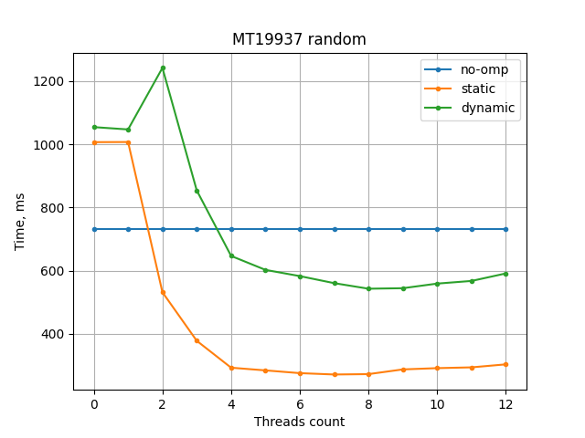
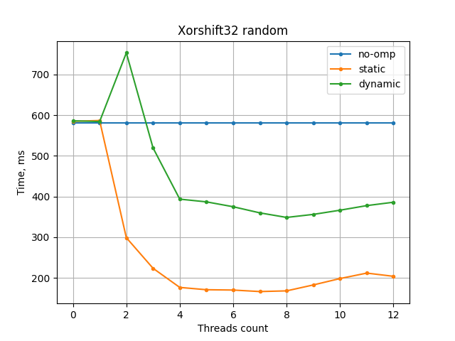
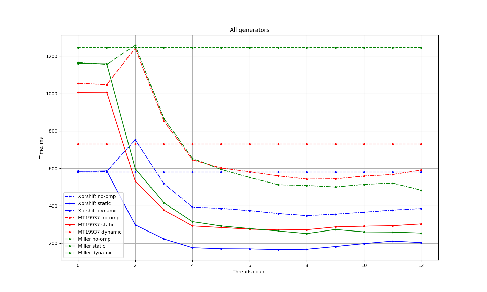
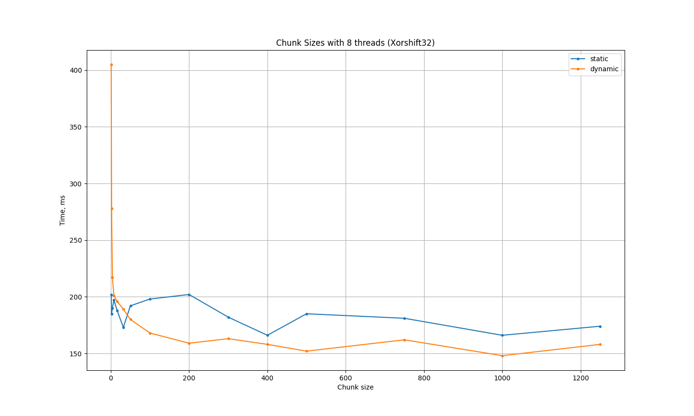

# OpenMP

## Инструментарий
С++20, компилятор: clang++ (llvm), OpenMP 2.0

## Что реализовано
Реализованно высчитывание объема переворма методом Монте-Карло. (с использованием OpenMP и без него).

# Описание:

Вычисления производились на процессоре Apple M1(8‑ядер).

> P.S. Мой процессор способен на каждом ядре выполнять 2 потока, те получается 8 + 8 = 16, но в графиках я использовал всего 12 потоков, чтоб показать какой поток наилучше себя показывает, а после 12 потоков скорость работы не становится быстрее. 

out.txt = 1.25664 (c погрешностями).

Для начала расскажу что происходит в моей программе.

В файлах `args.h` `args.cpp` я паршу аргументы. 

В файлах `hit.h` `hit.cpp` у меня есть функции: `hit_test` и `get_axis_range`. В функции `hit_test` я проверяю попали ли мы в область графика (сам график $a^2(y^2+z^2)-ax^3+x^4 = 0$, ($a=2$)) попадание происходит если результат по этой формуле $\le0$. Функция `get_axis_range` выдает массив из 6 элементов(`x_min`, `x_max`, `y_min`, `y_max`, `z_min`, `z_max`) высчитаных в ручную для нашего графика: 0.0, 2.0, -0.65, 0.65, -0.65, 0.65.

Далее в файлах `rand_1.cpp`, `rand_2.cpp` и `rand_3.cpp` у меня реализованны функции: `NoOmpRun_` и `NoOmpRun_` (в каждом файле они похожи, но реализованны для разных генераторов ПСЧ, об этом позже). В функции `NoOmpRun_` я выполняю подсчет без использования многопоточности (логика в обоих функциях одинаковая, поэтому опишу ее один раз, а потом расскажу как подключал многопоточность). Для начала высчитываю обьем куба в котором находится график, 
```cpp
 auto range = get_axis_range();
    float cube_volume =
        (range[1] - range[0]) * (range[3] - range[2]) * (range[5] - range[4]);
```
затем из input файла получаю количество итераций которое я должен воспроизвести. После задаю диапозоны для каждой координаты (каждый генератор ПСЧ у меня работает в диапозоне [0;1)), также каждый генератор зависит от сида, в моем случае это время запуска умноженое на номер потока, таким обрпазом в каждом потоке генерируется свой сид (это влияет на независимость потоков). Теперь самая основная часть начинаю замерять время с помощью `omp_get_wtime` и запускаю цикл в котором рандомно генерирую числа (`x`,`y`,`z`) и проверяю их на попадание.
```cpp
float x = range[0] + generator.next() * (range[1] - range[0]);
float y = range[2] + generator.next() * (range[3] - range[2]);
float z = range[4] + generator.next() * (range[5] - range[4]);
```
 В итоге получаю объем по формуле `volume = cube_volume * (all_hits / iter_count)`.
В функции `OmpRun` я делаю тоже самое но с включенной многопоточностью. Здесь указываю кол-во потоков из аргументов(`omp_set_num_threads(threads)`) и (`#pragma omp for shedule(static or dynamic)`).

# Про OMP:

Теперь о том как это работает (информацию брал с [сайта](http://jakascorner.com/blog/2016/06/omp-for-scheduling.html)).

Вот эти OpenMP директивы я использовал:
 - `parallel`: создайте команду потоков, которые выполняют вложенный блок кода параллельно.
 - `for`: разбивает цикл на более мелкие итерации, которые могут выполняться параллельно различными потоками.
 - `atomic`: указывает, что переменная должна быть доступна атомарно.

Так же есть еще:
- `sections`: разделите вложенный блок кода на различные секции, которые могут быть выполнены параллельно.
- `single`: указывает, что блок кода должен выполняться только одним потоком.
- `critic`: указывает, что блок кода должен выполняться только одним потоком за

 Если в крадце, конструкция `#pragma omp for` позволяет нам распараллелить наш цикл, и мы можем контролировать этот процесс с помощью аргументов `schedule`.

`Schedule(static, chunk_size)` конструкции цикла указывает, что цикл for имеет статический тип планирования. OpenMP делит итерации на фрагменты размером `chunk_size` и распределяет эти фрагменты по потокам в циклическом порядке.
```
schedule(static, 4):   
****            ****            ****            ****            
    ****            ****            ****            ****        
        ****            ****            ****            ****    
            ****            ****            ****            ****
```

`Schedule(dynamic, chunk_size)` конструкции цикла указывает, что цикл for имеет тип динамического планирования. OpenMP делит итерации на куски размером `chunk_size`. Каждый поток выполняет порцию итераций, а затем запрашивает еще одну порцию, пока не останется доступных порций.

```
schedule(dynamic, 4):  
            ****                    ****                    ****
****            ****    ****            ****        ****        
    ****            ****    ****            ****        ****    
        ****                    ****            ****            
```

`Schedule(guided, chunk_size)` - OpenMP снова делит итерации на куски. Каждый поток выполняет часть итерации, а затем запрашивает еще один кусок, пока больше не будет кусков доступный.

Разница с типом динамического планирования заключается в размере кусков. Тут куска пропорционален числу нераспределенных итераций, разделенных по количеству нитей. Поэтому размер кусков уменьшается.
```
schedule(guided):      
                            *********                        *  
                ************                     *******  ***   
                                     *******                   *
****************                            *****       **    * 
```
```
schedule(guided, 4):   
                                     *******                    
                ************                     ****    ****   
                            *********                           
****************                            *****    ****    ***
```
`schedule(auto)` делегирует решение о расписании компилятор и/или система времени выполнения.

В следующем примере компилятор/система определила статическое планирование.

```
schedule(auto):        
****************                                                
                ****************                                
                                ****************                
                                                ****************
```

Если мы не укажем тип планирования в цикле for OpenMP использует тип планирования по умолчанию (определяемый внутренним управлением переменный def-sched-var).

# Генераторы ПСЧ:

> в каждом графике представлены средние значения нескольких замеров (каждый замер делал 30 раз).

## Miller_rand:
Реализован в файле `rand_1.cpp`


## MT19937 rand:
Реализован в файле `rand_2.cpp`
```cpp
std::uniform_real_distribution<float> dist(0.0f, 1.0f);
std::mt19937 seed((omp_get_thread_num() + 1) * omp_get_wtime());
```


## Xorshift32 rand:
Реализован в файле `rand_3.cpp`


## Выводы про генераторы:

На этом графике видно прямое сравнение генераторов и лучший из них Xorshift32, вероятнее всего сильно влияет на это использование в нем только побитовых операторов. Далее будет использоваться именно он.

# Сравнение static и dinamic:

> На прошлых графиках видно, что на моем устройстве лучше всего себя показывает кол-во потоков равное 8. Поэтому буду использовать его. Также, на следующем графике буду выводить не среднее значение, а минимальное (минимальное время из 100 замеров)



Если не указывать chunk_size в программе явно, то static в разы быстрее чем dynamic. (это видно на предидущих графиках)

Но на этом графике при большинстве значений лучше dynamic.

> Самый быстрый результат у меня получаился при:
>  schedule(dynamic, 1000); threads = 8; generator = Xorshift32
>  143 ms. 